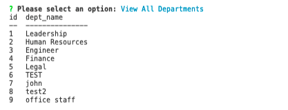
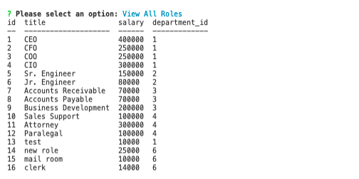
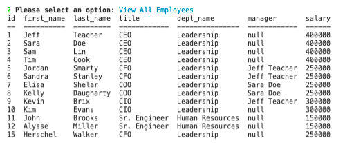
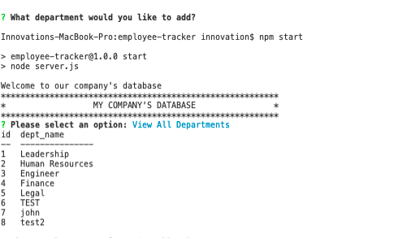
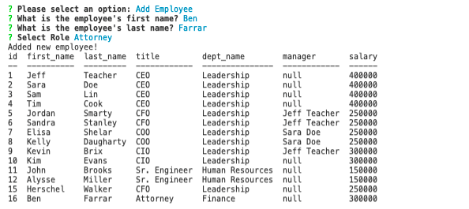
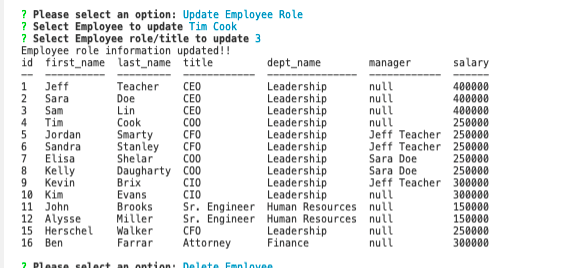
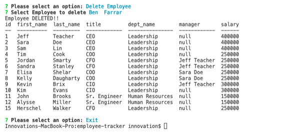

# 12 MYSQL: Employee Tracker

## Description
This is a simple command line CMS (content management system) that assists businesses with tracking and managing employee and departmental data using Node.js, Inquirer, and MySQL.

## Table of Contents

* Installation
* Links
* Preview

## Installation
Requires terminal and node packages.
* npm init -y
* npm install
* npm i inquirer
* mysql12 (npm install --save mysql2 or npm i mysql2)
* console table (npm install console.table --save)

## Links
*Link to Video: https://drive.google.com/file/d/1-MgtuUY3YmrbQjlkFmLVpFBKUG_VwHwb/view  
*Link to Repository: https://github.com/AmyWilhoite/employee-tracker.git    

## License
  

## Preview Screens
*View Department, Roles, Employees:
- 
- 
- 

*Add Department, Roles, Employees
- 
- 
- 

*Update Employee
- 

*Delete Employee
- 
